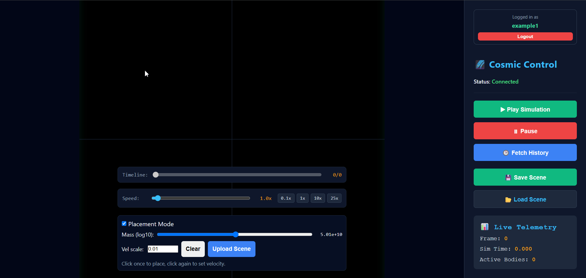
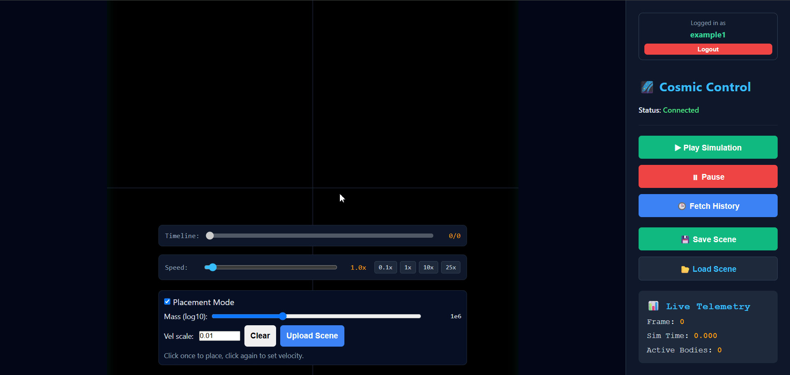
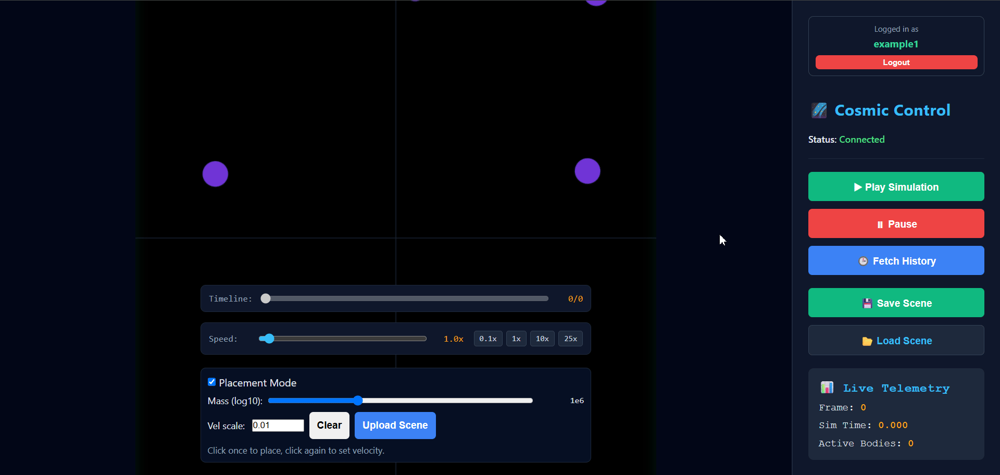
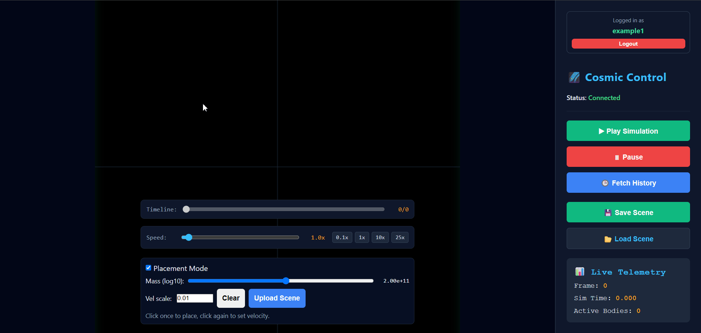

# 🌌 Real-Time Astrophysics Simulation & Interactive Sandbox

A high-performance, real-time N-body physics simulation and interactive space sandbox built with custom canvas rendering, real-time WebSocket communication, and responsive viewport management.

---

## 🎬 Cinematic Preview

### ⚡ Cosmic Creation & Real-Time Simulation
> Spawn celestial bodies with custom mass sliders and dynamically preview velocity vectors via interactive drag-and-drop mechanics.

### 🛸 Interactive Panorama, Hover & Pin
> Seamlessly toggle between placement and navigation modes to fluidly pan across infinite coordinate space while tracking live telemetry via inspection cards.

### ⏳ Temporal Time-Travel & History Scrubbing
> Scrub back and forth through spatial history frames using the timeline slider to analyze past cosmic states on the fly.

### 🚀 Variable Time-Step & Speed Scaling
> Dynamically accelerate or decelerate simulation execution speed to control orbital mechanics and high-velocity collisions.

### 🗄️ Full-Stack Spatial CRUD & State Persistence
> Effortlessly save, load, edit, and delete custom celestial configurations and system states with zero latency.

---

## ✨ Core Features

- **Interactive Placement Mode:** Spawn bodies with custom mass/radius mappings and preview velocity trajectories.
- **Seamless Camera Navigation:** Grab and drag to pan through a Cartesian coordinate plane with custom zoom parity.
- **Timeline History Traversal:** Scrub through recorded simulation frames with historical timeline slider.
- **Real-Time Telemetry Inspection:** Hover-based and pinned body cards tracking live mass, coordinates, and velocity vectors.
- **State Persistence (CRUD):** Save and reload custom universal configurations instantly. Edit description of scenes and delete certain scenes.

## 🛠️ Tech Stack

- **Frontend & Client:** Vanilla JavaScript (ES6+), HTML5 Canvas API, Responsive Viewport Engine, **REST API integration** & WebSockets for real-time telemetry.
- **Backend & Core Engine:** Go backend server interfacing with a high-performance C++ simulation engine via **gRPC and Protocol Buffers (Protobuf)** for ultra-low-latency binary streaming.
- **Data Persistence & Backend Services:** PostgreSQL managed through backend REST endpoints for full-stack spatial CRUD and state persistence.
- **Architecture:** Event-driven pointer handling, matrix coordinate mapping, etc.

## Important Notes
- **In Progress:** This project is currently in progress. We are planning to add session handling with auto-saving sessions, more robust logging and observability measures, testing, building CI/CD pipelines, and eventual deployment of the project as MVP.
- **⚠️ Known Issues & Active Development:** Due to the complex nature of real-time multi-tier simulation and inter-process streaming, minor bugs or edge cases may occasionally surface. We are continuously patching, refining, and optimizing the engine/server/frontend to elevate performance and stability.